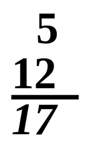

# _New Project_

#### By Liam Campbell
#### By Mo Byrne

#### _This webpage can count up to any number by any number_

## Technologies Used

* _HTML_
* _Jquery_
* _JavaScript_
* _CSS_
* _Bootstrap_

## Description

_This webpage can take input from a user to count up to a the inputted number by increments of a second inputted number. It will out put all the numbers that come in between while not going over the count to total._

## Setup/Installation Requirements

* _Clone the git repository github.com/lcmpbll/count-by to your desktop_
* _Navigate to the top level of the directoy._
* _Open index.html in your browser._

## Known Bugs

* If too large of a number is chosen, it may not compute.

## License

_Feel free to reach out via [Github](github.com.lcmpbll) to provide feedback on this project or to view my other projects._

[Copyright](LICENSE) (c) _06/17/2022_ _Liam Campbell and Mo Byrne_